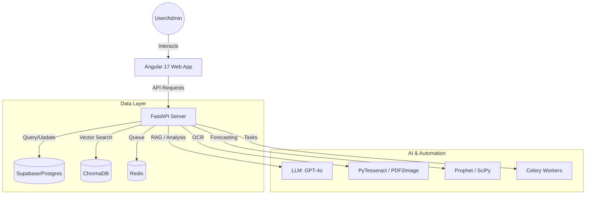

# 🏛️ UniGov: Strategic University Governance OS

[](https://fastapi.tiangolo.com/)
[](https://angular.io/)
[](https://supabase.com/)
[](https://www.trychroma.com/)

**UniGov (U-OS)** is the "Central Brain" for the university ecosystem. It transforms scattered, unstructured data into actionable intelligence across 30+ institutions, enabling AI-driven governance and strategic decision-making.

---

## 📸 Overview
UniGov addresses the core institutional bottleneck: data is no longer a liability; it is a strategic asset. Whether managing a network of institutions or a single campus, UniGov provides a "Single Source of Truth" for KPIs, alerts, and strategic roadmaps.

### 🧩 System Architecture



---

## ✨ The 4 Core Tracks

### 1. 📥 Track 1: Smart Data Engine (Ingestion)
*   **Omni-Channel Ingestion**: Upload institutional PDFs, CSVs, or scanned images.
*   **AI-OCR Pipeline**: Automated text extraction using PyTesseract with image preprocessing. Uses GPT-4o to "clean" and validate OCR output before database insertion.
*   **Structured Intelligence**: Parses unstructured text into standardized JSON for Student, HR, Finance, ESG, and Infrastructure domains, normalizing dates and monetary values.

### 2. 🧠 Track 2: AI Decision Engine (Analytics)
*   **Proactive Anomaly Detection**: Uses statistical analysis (Z-score thresholds via SciPy/Statsmodels) combined with LLM explanations to detect "spending leaks" or "academic drops."
*   **Predictive Forecasting**: Multi-step time-series forecasting using **Prophet** to predict future KPI trends.
*   **"What-If" Simulator**: A correlation engine (using NumPy) that allows leaders to simulate the impact of budget reallocations on academic outcomes.
*   **Strategic Benchmarking & ESG Optimizer**: Analyzes metrics to generate customized sustainability roadmaps and strategic advice.

### 3. 💬 Track 3: Natural Language AI Assistant (Interaction)
*   **Context-Aware Assistant**: A RAG-powered interface (using ChromaDB) that "reads" institutional policies and "sees" live metrics.
*   **Automated Reporting**: Generate comprehensive monthly reports with one click, complete with AI-generated Executive Summaries.

### 4. 🌐 Track 4: Multi-Institution Layer (Platform)
*   **Secure Multi-Tenancy**: Data isolation for each institution within a shared infrastructure.
*   **Global Export System**: Instant PDF/Excel generation for reporting and audits.

---

## 👥 Role-Based Access Control (RBAC Matrix)

UniGov enforces strict data segregation and routing security:

| Role | Capabilities | Visibility |
| :--- | :--- | :--- |
| **Super Admin** | Full network control, user management, analytics, global policy setting. | Global Dashboard (All 30+ Institutions) |
| **Agent** | Analyst access, AI Assistant, Analytics. Cannot manage users. | Global Dashboard |
| **Admin** | Management of a specific campus, local KPI tracking, and alerts. | Locked to assigned `institution_id` |

---

## 🎨 UI/UX: The "Sovereign Executive" Design System
Our custom frontend design system abandons generic Tailwind in favor of a bespoke, high-fidelity **Corporate Modern** aesthetic tailored for high-stakes decision-making.

*   **Fixed-Fluid Hybrid Layout**: A permanent "Command Center" navigation (260px sidebar) paired with a fluid max-1440px data canvas.
*   **Color Strategy**: Deep Navy (`#1B3A6B`) for stability, contrasted by Gold Accents (`#C8972A`) for high-priority insights, set against an expansive Gray 50 background.
*   **Typography**: *Plus Jakarta Sans* for commanding, executive headers, paired with *Inter* for dense, high-legibility data tables.
*   **Tonal Layering**: Ambient navy-tinted shadows define the Z-axis, lifting critical cards without adding visual clutter.

---

## 🛠️ API Documentation (v1)

| Endpoint | Method | Description |
| :--- | :--- | :--- |
| `/api/v1/dashboard/global` | `GET` | Fetch top-level metrics for the entire network. |
| `/api/v1/ai/prompt` | `POST` | Interact with the UniGov Strategic Assistant (RAG). |
| `/api/v1/analytics/what-if` | `POST` | Run Pearson correlation-based simulations between KPIs. |
| `/api/v1/ingestion/upload` | `POST` | Upload and process files through the AI-OCR pipeline. |
| `/api/v1/alerts/active` | `GET` | List all unacknowledged critical alerts. |

---

## 🚀 Quick Start

### Backend (The Core)
1. **Setup Env**: Copy `.env.example` to `.env` and fill in your Supabase and OpenAI keys.
2. **Install Dependencies**: `pip install -r requirements.txt`
3. **Initialize Database & Seed**: 
   ```bash
   python seed_data.py        # Populates 12 months of historical data
   python create_admin.py     # Creates your superadmin account
   python create_test_users.py # Creates RBAC test accounts (admin/agent)
   ```
4. **Launch Server**: `uvicorn app.main:app --reload`

### Frontend (The UI)
1. **Install Dependencies**: `npm install`
2. **Launch App**: `npm start`
3. **Login**: Use test credentials seeded in the backend.

---

## 🔮 Future Roadmap
- [ ] **Mobile Executive Dashboard**: iOS/Android app for real-time alert notifications.
- [ ] **Predictive Maintenance**: Infrastructure monitoring using IoT sensor data.
- [ ] **Blockchain Credentials**: Immutable storage for academic certificates and degrees.
- [ ] **Multi-Language Support**: Full localization for international university networks.

---

## 🤝 Contribution
Developed with ❤️ for the **University Governance Hackathon**. 
**UniGov Team 2025**
